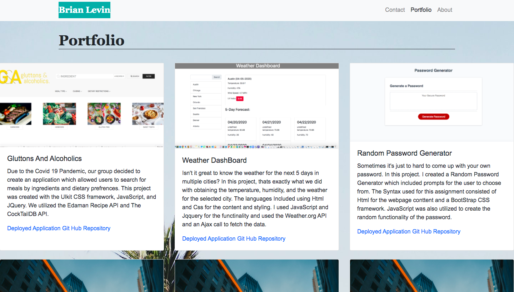

# Portfolio

This is my portfolio highlighting some of my completed projects.

## Libraries and Frameworks

 - Html
 - CSS
 - BootStrap

 ## Process:
I used html, css, and bootstrap to write  and style the pages and used images from my previous projects.

 ## Deployed Application:

https://brianlevin.github.io/

